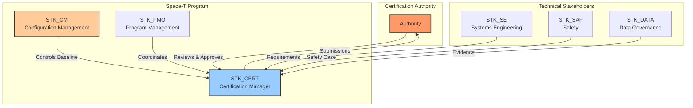

# K01 Authority Model Overview

```mermaid
graph TB
    subgraph Authority["Certification Authority"]
        AUTH[Authority]
    end
    
    subgraph Program["Space-T Program"]
        CERT[STK_CERT<br/>Certification Manager]
        CM[STK_CM<br/>Configuration Management]
        PMO[STK_PMO<br/>Program Management]
    end
    
    subgraph Technical["Technical Stakeholders"]
        SE[STK_SE<br/>Systems Engineering]
        SAF[STK_SAF<br/>Safety]
        DATA[STK_DATA<br/>Data Governance]
    end
    
    AUTH -->|Reviews & Approves| CERT
    CERT -->|Submissions| AUTH
    CM -->|Controls Baseline| CERT
    PMO -->|Coordinates| CERT
    SE -->|Requirements| CERT
    SAF -->|Safety Case| CERT
    DATA -->|Evidence| CERT
    
    style AUTH fill:#f96,stroke:#333,stroke-width:2px
    style CERT fill:#9cf,stroke:#333,stroke-width:2px
    style CM fill:#fc9,stroke:#333,stroke-width:2px
```

**Description**: Overview of the certification authority model showing relationships between stakeholders and the certification authority.
