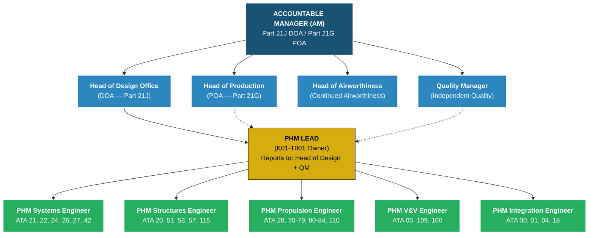
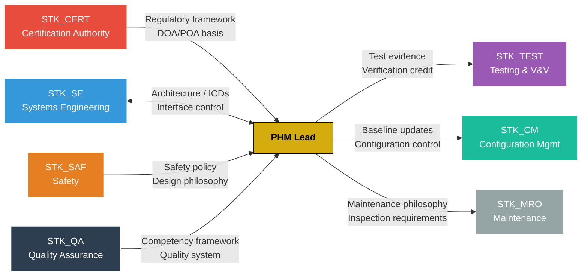

# PHM Organizational Chart within DOA/POA Structure

## 1. Diagram Information

| Field | Details |
| :--- | :--- |
| **Type:** | Organizational Chart |
| **Format:** | Mermaid |
| **Purpose:** | Define the PHM (Physical Hardware & Mechanical Engineering) organizational structure within the AMPEL360 Design Organisation Approval (DOA, EASA Part 21 Subpart J) and Production Organisation Approval (POA, EASA Part 21 Subpart G) framework |
| **Scope:** | PHM AoR — all PHM-owned ATA chapters |
| **Owner:** | PHM Lead |
| **Last Updated:** | 2026-02-25 |
| **Task Reference:** | K01-T001 |

## 2. Diagram Description

### 2.1 Purpose

This diagram defines how **Prognostics & Health Management (PHM)** engineering authority is structured within the AMPEL360 DOA/POA approval structure. It establishes reporting lines, delegation of authority, and the mapping of PHM roles to ATA chapter responsibilities.

### 2.2 Scope and Context

- **DOA (Part 21J):** Design organization approval — covers PHM design authority, means of compliance, and certification submissions.
- **POA (Part 21G):** Production organization approval — covers PHM manufacturing oversight, inspection authority, and production conformity.
- **PHM AoR:** Physical Hardware & Mechanical Engineering — responsible for structural, mechanical, and hardware domains across ~30 ATA chapters.

### 2.3 Regulatory Basis

| Regulation | Applicability |
| :--- | :--- |
| EASA Part 21 Subpart J (DOA) | PHM design authority within DOA structure |
| EASA Part 21 Subpart G (POA) | PHM production oversight within POA structure |
| CS-25 | Certification specifications for large aeroplanes (structural, mechanical) |
| ECSS-E-ST-32C | Space structural standards (pressure vessels, mechanisms) |
| 14 CFR Part 25 | FAA airworthiness standards (structural substantiation) |

### 2.4 Notations and Conventions

| Symbol | Meaning |
| :--- | :--- |
| Solid line | Direct reporting |
| Dashed line | Functional / dotted-line reporting |
| Bold text | Accountable role |
| ATA references | Chapters owned by each role |

## 3. Organizational Chart

### 3.1 Top-Level DOA/POA Structure

### 3.2 PHM Role Definitions

| Role | Reporting To | ATA Chapters | Key Responsibilities |
| :--- | :--- | :--- | :--- |
| **PHM Lead** | Head of Design (primary), Quality Manager (functional) | All PHM-owned | Overall PHM strategy, certification coordination, delegation of authority |
| **PHM Systems Engineer** | PHM Lead | 21, 22, 24, 26, 27, 42 | ECS, auto-flight, electrical, fire protection, flight controls, IMA |
| **PHM Structures Engineer** | PHM Lead | 20, 51, 53, 57, 115 | Airframe practices, structural standards, fuselage/pressure vessel, wings, SpaceT structural |
| **PHM Propulsion Engineer** | PHM Lead | 28, 70-79, 80-84, 110 | Fuel/propellant, engine/propulsion, starting, turbopump, propellant systems |
| **PHM V&V Engineer** | PHM Lead | 05, 109, 100 | Time limits, SpaceT thermal verification, SpaceT-specific verification |
| **PHM Integration Engineer** | PHM Lead | 00, 01, 04, 18 | General coordination, organization policy, airworthiness limitations, vibration/noise |

### 3.3 Cross-Stakeholder Interfaces

## 4. DOA Responsibilities (Part 21J)

| Responsibility | PHM Role | Authority Level |
| :--- | :--- | :--- |
| Design data approval for structural components | PHM Structures Engineer | L2 — Approve (delegated from PHM Lead) |
| Design data approval for systems components | PHM Systems Engineer | L2 — Approve (delegated from PHM Lead) |
| Design data approval for propulsion components | PHM Propulsion Engineer | L2 — Approve (delegated from PHM Lead) |
| Means of compliance agreement with CERT | PHM Lead | L1 — Authority (with Head of Design) |
| Certification submission evidence packages | PHM V&V Engineer | L2 — Approve (delegated from PHM Lead) |
| Design change classification (minor/major) | PHM Lead | L2 — Approve |
| Equivalent safety finding proposals | PHM Lead + PHM Structures Engineer | L1 — Authority (requires Head of Design) |

## 5. POA Responsibilities (Part 21G)

| Responsibility | PHM Role | Authority Level |
| :--- | :--- | :--- |
| Production conformity for structural parts | PHM Structures Engineer | L2 — Approve (with Production) |
| Manufacturing process approval for hardware | PHM Propulsion Engineer | L2 — Approve (with Production) |
| Inspection criteria definition for hardware | PHM V&V Engineer | L2 — Approve |
| Non-conformance disposition (structural/mechanical) | PHM Lead | L2 — Approve (with Quality Manager) |
| Supplier qualification for PHM hardware | PHM Integration Engineer | L3 — Recommend (Head of Production decides) |

## 6. Trace Links

| Link Type | Target | Status |
| :--- | :--- | :--- |
| satisfies | K01-T001 | Proposed |
| derives_from | EASA Part 21 Subpart J (DOA) | Proposed |
| derives_from | EASA Part 21 Subpart G (POA) | Proposed |
| inputs_to | K01-T002 (Engineering authority delegation) | Proposed |
| inputs_to | K01-T005 (Competency requirements) | Proposed |
| inputs_to | K01-T006 (Interface control) | Proposed |

## 7. Change History

| Version | Date | Changes | Changed By |
| :--- | :--- | :--- | :--- |
| I01-R01 | 2026-02-25 | Initial draft — PHM org chart within DOA/POA | PHM Lead |

## 8. Approval

| Role | Name | Date | Signature |
| :--- | :--- | :--- | :--- |
| PHM Lead | ___________________ | __________ | __________ |
| Head of Design (DOA) | ___________________ | __________ | __________ |
| Quality Manager | ___________________ | __________ | __________ |
| STK_CERT Representative | ___________________ | __________ | __________ |
