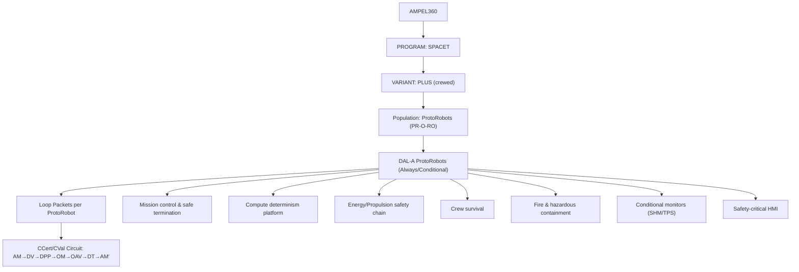
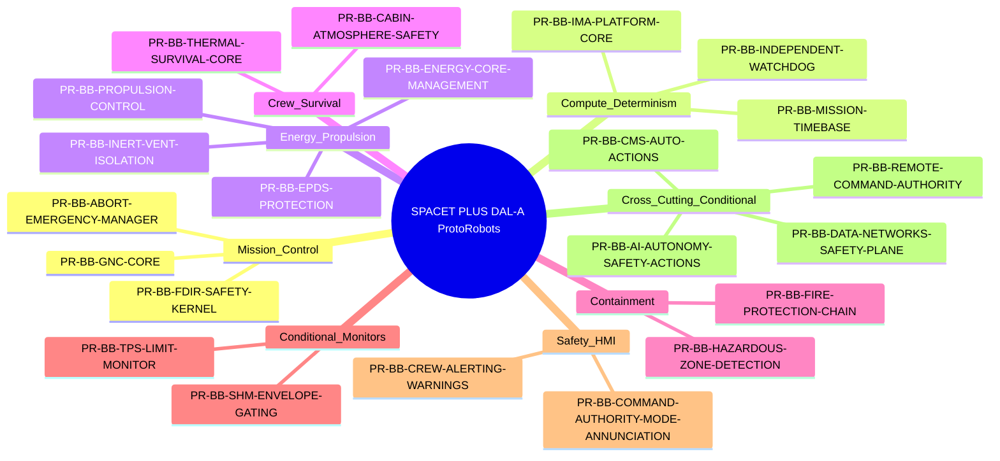

# SPACET PLUS — DAL-A Critical ProtoRobots (PR-O-RO) List

## 1. Purpose
This artifact defines the **DAL-A critical ProtoRobots** for **AMPEL360 / SPACET / PLUS** (crewed).  
It is used to:
- identify **catastrophic failure pathways** requiring DAL-A assurance,
- declare **PR-O-RO "Body + Brain" duality** per ProtoRobot,
- anchor cross-ATA ownership, interfaces, and evidence expectations (K01 / CCert-CVal loop).

> **DAL-A meaning (program level):** failure conditions that can lead to **loss of crew**, **loss of vehicle**, **uncontrolled trajectory**, or inability to safely terminate/contain hazards in critical mission phases.

---

## 2. Visual Representation (PR-O-RO + DAL-A)



---

## 3. PR-O-RO Duality Model (Body + Brain)

### 3.1 What PR-O-RO means in SPACET

**PR-O-RO** ("ProtoRobotics") treats each safety-relevant capability as a **ProtoRobot**:

* a **bounded, certifiable hybrid artifact** that can be engineered, validated, and governed,
* not merely a component: it includes **physical manifestation**, **embedded intelligence**, and **operational evidence**.

A ProtoRobot is always defined by the **duality**:

### 3.2 Body (Manifestation)

The **Body** is the **physical or interface manifestation** of a capability:

* structures, actuators, sensors, valves, harnesses, thermal shields,
* or the "UI-Body" of a function (human interface surfaces) when it materially affects safety.

**Body failure** typically produces: mechanical loss, leak/containment loss, thermal breach, inability to actuate, degraded sensing.

### 3.3 Brain (Governed Intelligence)

The **Brain** is the **governed intelligence layer** that controls or constrains the Body:

* control laws, FDIR logic, safety kernels, partitioning/timing rules,
* monitors, thresholds, mode logic, and the verification/evidence logic.

**Brain failure** typically produces: wrong control decisions, undetected hazards, incorrect mode transitions, unsafe automation, loss of determinism.

### 3.4 Why duality matters for DAL-A

In SPACET PLUS, **catastrophic outcomes often arise from interactions**:

* a "perfect Body" can be driven into catastrophe by a wrong Brain decision,
* a "correct Brain" can become irrelevant if the Body cannot actuate or contain hazards.

Therefore, each DAL-A ProtoRobot is specified with:

* **Body scope**, **Brain scope**, **assurance obligations**, and **interfaces**.

---

## 4. Population Model (PROGRAM-centric; replaces FAMILY)

### 4.1 Hierarchy

```text
Population
└── PROGRAM (Genome-equivalent, governed baseline)
    └── VARIANT (Certified adaptation)
        └── INSTANCE (Individual vehicle / MSN)
            └── BB Artifacts (Organs)
                └── Loop Packets (Medical records / evidence dossiers)
```

### 4.2 Analogy table (PROGRAM framing)

| Level    | Biological analogy                          | PR-O-RO implementation                                    |
| -------- | ------------------------------------------- | --------------------------------------------------------- |
| Program  | Program "genome" (common governed baseline) | Program baseline + certification rules + evidence grammar |
| Variant  | Certified adaptation                        | Variant configuration rules + effectivity constraints     |
| Instance | Individual (single vehicle)                 | Instance DT + operational history and measured truth      |
| Artifact | Organ                                       | BB/ProtoRobot Loop Packet (requirements→evidence→release) |

### 4.3 Inheritance rules (PROGRAM)

* **Claims inherit downward:** PROGRAM baseline applies to VARIANT/INSTANCE unless a **certified override** exists.
* **Evidence accumulates upward:** INSTANCE DT feeds statistics for VARIANT and consolidates knowledge into PROGRAM.
* **Changes propagate under control:** an **AM′** at any level triggers re-validation cascade based on effectivity and criticality.

---

## 5. Relationship to CCert/CVal Loop (Operational Truth)

Each DAL-A ProtoRobot must produce **Loop Packets** (evidence snapshots) across the program loop:

AM → DV → DPP → OM → OAV → DT → AM′

* **DV** provides predicted safety/limits
* **OAV** provides measured truth
* **DT** accumulates truth into the program baseline
* **AM′** is a certified evolution

**Key constraint for certifiability:** every loop step produces **evidence artifacts** that can be packaged and audited (CCert/CVal).

---

## 6. DAL-A ProtoRobots Map (Quick View)



---

## 7. DAL-A Critical ProtoRobots (Complete List)

**Legend**

* **Primary ATA(s):** main ATA owners (Space-T allocation)
* **AoR:** Area of Responsibility (portal entry point)
* **DAL-A Condition:** "Always" or "Conditional" (becomes DAL-A if used for safety-primary control)

### 7.1 Mission control and safe termination (Brain-dominant)

1. **PR-BB-GNC-CORE** — Guidance/Navigation/Control Core

* **Body:** flight control actuation chain + sensor inputs for attitude/trajectory authority
* **Brain:** guidance laws, control laws, state estimation, envelope protection interface
* **Primary ATA(s):** 22, 27, 34 (+ 42, 40, 31)
* **AoR:** SE (with SAF/CERT)
* **DAL-A Condition:** **Always**

2. **PR-BB-FDIR-SAFETY-KERNEL** — Safety Kernel (FDIR + Limit Enforcement)

* **Body:** redundant sensing paths + actuation inhibit/override pathways
* **Brain:** fault detection, isolation, recovery, limit logic, safe mode trigger
* **Primary ATA(s):** 40, 42 (+ 31, 46)
* **AoR:** SAF / SE
* **DAL-A Condition:** **Always**

3. **PR-BB-ABORT-EMERGENCY-MANAGER** — Abort & Emergency Mode Manager

* **Body:** abort actuators, safe termination actuation chain, crew alert surfaces
* **Brain:** abort logic, trajectory switching, safe termination sequencing, authority rules
* **Primary ATA(s):** 22, 27, 34 (+ 40, 42, 31)
* **AoR:** SAF / OPS
* **DAL-A Condition:** **Always**

### 7.2 Compute platform and determinism (Brain+platform)

4. **PR-BB-IMA-PLATFORM-CORE** — Compute Platform Partitioning & Timing Core

* **Body:** processing hardware, buses, memory isolation, power rails (as relevant)
* **Brain:** partitioning rules, scheduling, timing budgets, deterministic execution guarantees
* **Primary ATA(s):** 42 (+ 24, 40)
* **AoR:** SW/HW with CERT
* **DAL-A Condition:** **Always**

5. **PR-BB-INDEPENDENT-WATCHDOG** — Independent Reset/Watchdog Supervisor

* **Body:** independent watchdog hardware, reset lines, safe-state outputs
* **Brain:** reset policy, safe restart criteria, brownout handling, controlled recovery
* **Primary ATA(s):** 24, 42
* **AoR:** HW / SAF
* **DAL-A Condition:** **Always**

6. **PR-BB-MISSION-TIMEBASE** — Time Synchronization & Event Ordering

* **Body:** time sources, distribution paths, recording triggers
* **Brain:** time discipline, coherence checks, monotonic event ordering rules
* **Primary ATA(s):** 40, 31, 46
* **AoR:** SE / DATA
* **DAL-A Condition:** **Always** (for crewed critical phases)

### 7.3 Energy and propulsion safety chain (Body-dominant with Brain control)

7. **PR-BB-EPDS-PROTECTION** — Electrical Power Distribution & Protection

* **Body:** generation/storage interfaces, HVDC distribution, protection devices, load buses
* **Brain:** protection logic, load shedding policy, reconfiguration rules
* **Primary ATA(s):** 24 (+ infra interfaces 80–83 if applicable)
* **AoR:** SE / SAF
* **DAL-A Condition:** **Always**

8. **PR-BB-ENERGY-CORE-MANAGEMENT** — H2/Cryo/Battery Safety Management

* **Body:** tanks, valves, pressure relief, sensors, containment, thermal conditioning
* **Brain:** leak detection logic, vent/inert policy, hazard zoning enforcement
* **Primary ATA(s):** 28, 35/36 (as applicable), 47
* **AoR:** SAF / PROP / SPACEPORT (interfaces)
* **DAL-A Condition:** **Always**

9. **PR-BB-PROPULSION-CONTROL** — Propulsion Control (FADEC-like)

* **Body:** actuators/valves, engine interfaces, thrust command path
* **Brain:** control logic, limits, shutdown/restart sequencing, anomaly response
* **Primary ATA(s):** 72, 73, 76
* **AoR:** PROP / SW with CERT
* **DAL-A Condition:** **Always**

10. **PR-BB-INERT-VENT-ISOLATION** — Propellant Isolation / Inerting / Venting Safety

* **Body:** inerting hardware, vent lines, isolation valves, sensors
* **Brain:** purge sequences, interlocks, hazardous state logic
* **Primary ATA(s):** 47, 28 (+ 26 fire linkage)
* **AoR:** SAF / PROP
* **DAL-A Condition:** **Always**

### 7.4 Crew survival (Body + Brain, mission-phase critical)

11. **PR-BB-CABIN-ATMOSPHERE-SAFETY** — Cabin Pressure & Atmosphere Safety Control

* **Body:** pressure vessel interfaces, valves, oxygen supply and distribution, sensors
* **Brain:** pressure/oxygen control, emergency logic, alarms, safe mode transitions
* **Primary ATA(s):** 21, 35, 36
* **AoR:** SAF / OPS
* **DAL-A Condition:** **Always**

12. **PR-BB-THERMAL-SURVIVAL-CORE** — Thermal Control Safety Core (Crew + Avionics)

* **Body:** thermal loops, heaters/coolers, sensors, insulation interfaces
* **Brain:** thermal limit enforcement, emergency thermal modes
* **Primary ATA(s):** 21 (+ 24 power coupling)
* **AoR:** SE / SAF
* **DAL-A Condition:** **Always**

### 7.5 Fire and hazardous containment

13. **PR-BB-FIRE-PROTECTION-CHAIN** — Fire Detection & Suppression Safety Chain

* **Body:** sensors, extinguishing agents, distribution, compartmentation interfaces
* **Brain:** detection logic, suppression sequencing, alerting and procedures triggers
* **Primary ATA(s):** 26
* **AoR:** SAF
* **DAL-A Condition:** **Always**

14. **PR-BB-HAZARDOUS-ZONE-DETECTION** — H2 Leak / O2 Enrichment / Toxic Detection

* **Body:** gas sensors, sampling, alarm actuators, isolation triggers
* **Brain:** hazard classification, shutdown/inert/vent triggers, crew procedure triggers
* **Primary ATA(s):** 28, 35/36, 26 (+ 31 for alerting)
* **AoR:** SAF / OPS
* **DAL-A Condition:** **Always**

### 7.6 Structural integrity monitors (Conditional DAL-A)

15. **PR-BB-SHM-ENVELOPE-GATING** — Structural Health Monitoring with Active Envelope Gating

* **Body:** strain/acceleration/thermal sensors, SHM network, mounting integrity
* **Brain:** SHM inference + decision thresholds when it gates flight envelope or abort triggers
* **Primary ATA(s):** 45, 53/55/57 (+ 96 if ML governance applies)
* **AoR:** STR / SAF
* **DAL-A Condition:** **Conditional** (DAL-A if used for automatic safety actions)

16. **PR-BB-TPS-LIMIT-MONITOR** — Thermal Protection System Limit Monitor (Re-entry)

* **Body:** TPS sensors, inspection interfaces, thermal barriers
* **Brain:** over-temp detection, limit enforcement, abort triggers
* **Primary ATA(s):** 21 (+ 53/57 integration), 31/45 monitoring
* **AoR:** STR / SAF
* **DAL-A Condition:** **Conditional** (DAL-A if it triggers automatic safety actions)

### 7.7 Human interface safety-critical (Brain + UI-Body)

17. **PR-BB-CREW-ALERTING-WARNINGS** — Crew Alerting & Safety-Critical Displays

* **Body:** display surfaces, audio/visual annunciators
* **Brain:** alert logic, prioritization, inhibit rules, failure annunciation
* **Primary ATA(s):** 31 (+ 22/27 context)
* **AoR:** OPS / SAF
* **DAL-A Condition:** **Always** (for crewed critical phases)

18. **PR-BB-COMMAND-AUTHORITY-MODE-ANNUNCIATION** — Command Authority & Mode Integrity

* **Body:** mode annunciation UI, authority selection interfaces
* **Brain:** command source arbitration, mode transition rules, confusion prevention
* **Primary ATA(s):** 31, 22/27 (+ 46 if remote ops enabled)
* **AoR:** OPS / SAF / CY
* **DAL-A Condition:** **Always**

---

## 8. Cross-cutting ProtoRobots (DAL-A conditional by architecture decisions)

These ProtoRobots become **DAL-A** if the program architecture makes them **single-point** or **safety-primary**.

19. **PR-BB-DATA-NETWORKS-SAFETY-PLANE** — Safety-Critical Data Networks

* **Primary ATA(s):** 46
* **AoR:** CY / SW / SE
* **DAL-A Condition:** conditional (DAL-A if safety traffic is not segregated/redundant)

20. **PR-BB-AI-AUTONOMY-SAFETY-ACTIONS** — AI/Autonomy Components that Command Safety Actions

* **Primary ATA(s):** 90, 96, 114
* **AoR:** AI / SAF / CERT
* **DAL-A Condition:** conditional (DAL-A if ML directly commands thrust/actuation or triggers abort)

21. **PR-BB-CMS-AUTO-ACTIONS** — Health Monitoring with Automatic Safety Actions

* **Primary ATA(s):** 45
* **AoR:** MRO / DATA / SAF
* **DAL-A Condition:** conditional (DAL-A if it triggers immediate safety action, not advisory)

22. **PR-BB-REMOTE-COMMAND-AUTHORITY** — Remote Operations / Off-board Command Authority

* **Primary ATA(s):** 80–87 (infra), 46 (network), 31 (HMI)
* **AoR:** OPS / SPACEPORT / CY / CERT
* **DAL-A Condition:** conditional (DAL-A if allowed during safety-critical phases)

---

## 9. Minimum Assurance Obligations for DAL-A ProtoRobots (K01-ready)

For each DAL-A ProtoRobot (Always or Conditional-Active), the program shall provide:

1. **Deterministic safety path**

* safe mode / safe termination behavior defined and verified.

2. **Partitioning and independence**

* avoid common-cause failures; enforce separation of DAL-A from lower DAL logic.

3. **Evidence pack linkage**

* trace links: `ProtoRobot → requirements/criteria → verification → evidence pack → release snapshot`.

4. **Monitoring and NKU management**

* define monitored variables, thresholds, and NKU tracking where uncertainty remains.

5. **TEKNIA sharing controls**

* evidence-first publication; effectivity and RBAC enforced; audit query reproducibility demonstrated.

---

## 10. Notes / Open knots (to be resolved)

* Confirm whether **ATA 34 Navigation** is included as a core Space-T "technology ATA" in the 52-ATA set used for K01 workflows, or treated as a referenced dependency from ATA 22/31/40/42.
* Decide if **remote command authority** is allowed in any crewed critical phase; if yes, elevate PR-BB-REMOTE-COMMAND-AUTHORITY to **Always DAL-A**.
* Decide if SHM/TPS monitors can trigger **automatic** abort or envelope gating; if yes, elevate their DAL to **Always DAL-A** for relevant phases.
