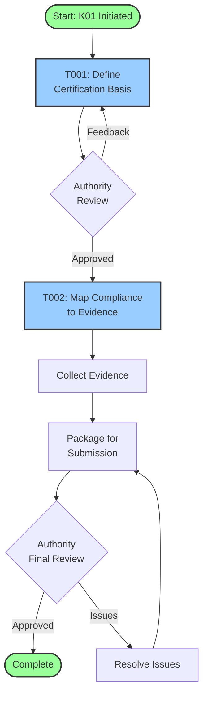

# K01 Compliance Workflow

```mermaid
flowchart TD
    Start([Start: K01 Initiated]) --> T001
    T001[T001: Define<br/>Certification Basis] --> Review1{Authority<br/>Review}
    Review1 -->|Approved| T002
    Review1 -->|Feedback| T001
    T002[T002: Map Compliance<br/>to Evidence] --> Collect[Collect Evidence]
    Collect --> Package[Package for<br/>Submission]
    Package --> Review2{Authority<br/>Final Review}
    Review2 -->|Approved| Complete([Complete])
    Review2 -->|Issues| Resolve[Resolve Issues]
    Resolve --> Package
    
    style Start fill:#9f9,stroke:#333,stroke-width:2px
    style Complete fill:#9f9,stroke:#333,stroke-width:2px
    style T001 fill:#9cf,stroke:#333,stroke-width:2px
    style T002 fill:#9cf,stroke:#333,stroke-width:2px
```

**Description**: High-level workflow for K01 certification basis and compliance mapping activities.
