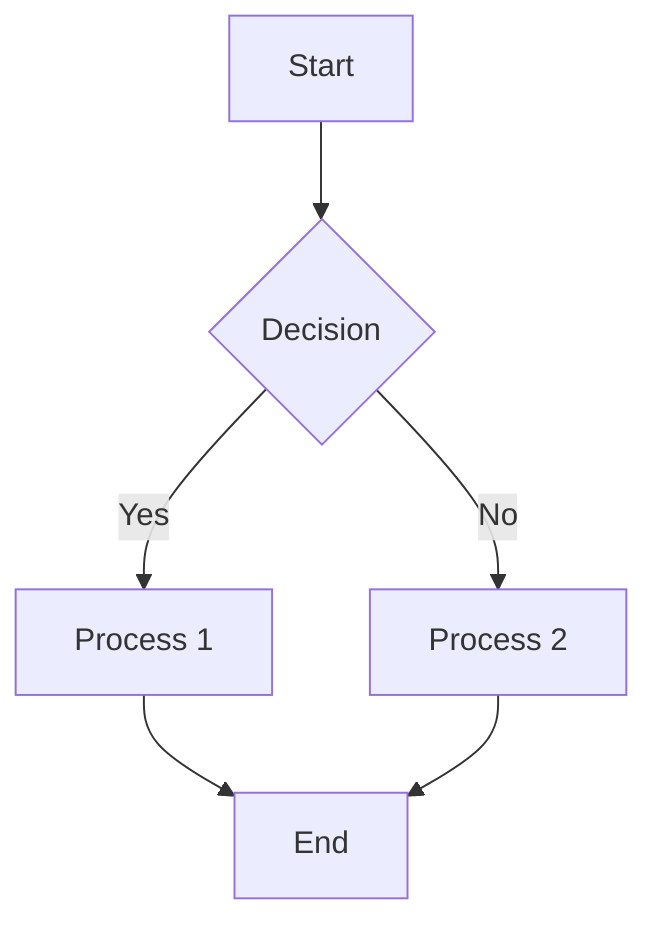

# Diagram: {{TITLE}}

## 1. Diagram Information

| Field | Details |
| :--- | :--- |
| **Type:** | [Architecture/Flow/Sequence/State/etc.] |
| **Format:** | [Mermaid/PlantUML/SVG/PDF] |
| **Purpose:** | {{DESCRIPTION}} |
| **Scope:** | [System/Subsystem/Component] |
| **Owner:** | {{OWNER}} |
| **Last Updated:** | {{DATE}} |

## 2. Diagram Description

### 2.1 Purpose
Description of what this diagram illustrates and its intended audience.

### 2.2 Scope and Context
System boundaries and context for this diagram.

### 2.3 Notations and Conventions

| Symbol | Meaning |
| :--- | :--- |
| Rectangle | Component |
| Arrow | Data flow |
| Diamond | Decision point |

## 3. Diagram

### 3.1 Main Diagram

### 3.2 Alternative Format

For complex diagrams, reference external files:

**File:** `diagrams/{{DESCRIPTION}}.svg`  
**Tool:** [Tool name and version]

## 4. Component Details

### 4.1 Component: A - Start

**Type:** Entry Point  
**Description:** System initialization  
**Inputs:** None  
**Outputs:** Initialization complete signal

### 4.2 Component: B - Decision

**Type:** Decision Point  
**Description:** Check condition X  
**Inputs:** System state  
**Outputs:** Yes/No decision  
**Logic:** If condition X is true, proceed to C; otherwise, proceed to D

### 4.3 Component: C - Process 1

**Type:** Process  
**Description:** Execute primary process  
**Inputs:** [List]  
**Outputs:** [List]  
**Requirements:** [REQ-ID]

### 4.4 Component: D - Process 2

**Type:** Process  
**Description:** Execute alternative process  
**Inputs:** [List]  
**Outputs:** [List]  
**Requirements:** [REQ-ID]

### 4.5 Component: E - End

**Type:** Exit Point  
**Description:** System completion  
**Inputs:** Process completion signal  
**Outputs:** None

## 5. Interfaces and Data Flows

### 5.1 Interface Definitions

| Interface | From | To | Data Type | Protocol | Description |
| :--- | :--- | :--- | :--- | :--- | :--- |
| IF-001 | A | B | [Type] | [Protocol] | [Description] |
| IF-002 | B | C | [Type] | [Protocol] | [Description] |

### 5.2 Data Flow Details

**Flow A → B:**
- Data: [Description]
- Format: [Format]
- Frequency: [Rate]
- Requirements: [REQ-ID]

## 6. Scenarios and Use Cases

### 6.1 Nominal Scenario

1. Start at A
2. Evaluate condition at B
3. If condition is true:
   - Execute process C
   - Complete at E
4. If condition is false:
   - Execute process D
   - Complete at E

### 6.2 Alternative Scenarios

**Scenario 2: [Name]**
- [Description of alternative flow]

**Scenario 3: [Name]**
- [Description of error or exception case]

## 7. Requirements Traceability

| Component | Requirements | Verification |
| :--- | :--- | :--- |
| A - Start | REQ-001 | Test Case TC-001 |
| B - Decision | REQ-002, REQ-003 | Analysis ANA-001 |
| C - Process 1 | REQ-004 | Test Case TC-002 |

## 8. Related Diagrams

- **Parent Diagram:** [Reference to higher-level diagram]
- **Child Diagrams:** [References to detailed diagrams]
- **Related:** [References to related diagrams]

## 9. Assumptions and Constraints

**Assumptions:**
1. [Assumption 1]
2. [Assumption 2]

**Constraints:**
1. [Constraint 1]
2. [Constraint 2]

## 10. Revision History

| Version | Date | Changes | Author |
| :--- | :--- | :--- | :--- |
| {{VERSION}} | {{DATE}} | Initial diagram | {{OWNER}} |

## 11. Export Formats

This diagram is available in multiple formats:

- **Source:** Mermaid/PlantUML code (in this document)
- **SVG:** `diagrams/{{DESCRIPTION}}.svg`
- **PNG:** `diagrams/{{DESCRIPTION}}.png`
- **PDF:** `diagrams/{{DESCRIPTION}}.pdf`

## 12. References

- System architecture document: [DOC-ID]
- Requirements specification: [DOC-ID]
- Interface control document: [DOC-ID]
